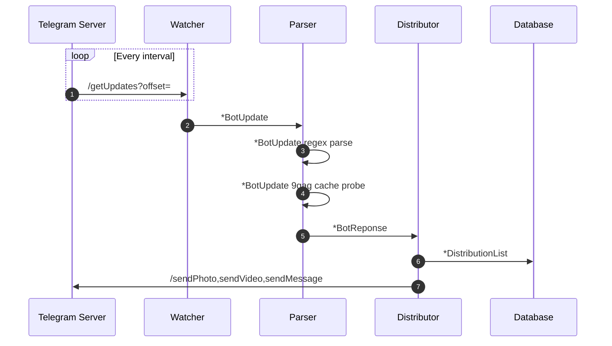

# telegram-scaffold
This library enables you to build telegram apps rapidly , scaffolding around the telegram bots. Just get your bot up and running provide the authentication details and you have polling, functions, response functions available

Scaffolding provides 2 piece functions 
--------
1. Watcher  - The one that controls the interval at which `/getUpdates` is fired. This sends out interfaced object to distribution function over a channel. This is tightly coupled with receiving updates on Telegram using a bot.
2. Distributor - A distributor is the one that awaits an object that has relevant information just necessary to dispatch messages using `sendMessage, sendPhoto, sendVideo, sendAnimation` This is tightly coupled with sending messages via telegram 

Domain logic and parsers:
--------

Parsers are intended to work ahead of watchers but before distribution. These are extensible pieces that cater to a particular use case. 
example : 9gag fwding tasks have messages in a fixed agreed format that the bot reads and helps tranlates the `BotUpdate` model to distributor model. (typically BotReponse model ). Parsers acts as a model conversion function tightly coupled to BotResponses on one side while act on the `BotUpdate.Message.Text` on the other

Distribution and selection of groups
--------
Selection few / all groups from the registered groups in database, is what the distributor refers to, but the finder gets from the database. 
Finder interface is what the distributor refers to to get all the group chatids for relevant groups for a response. 
