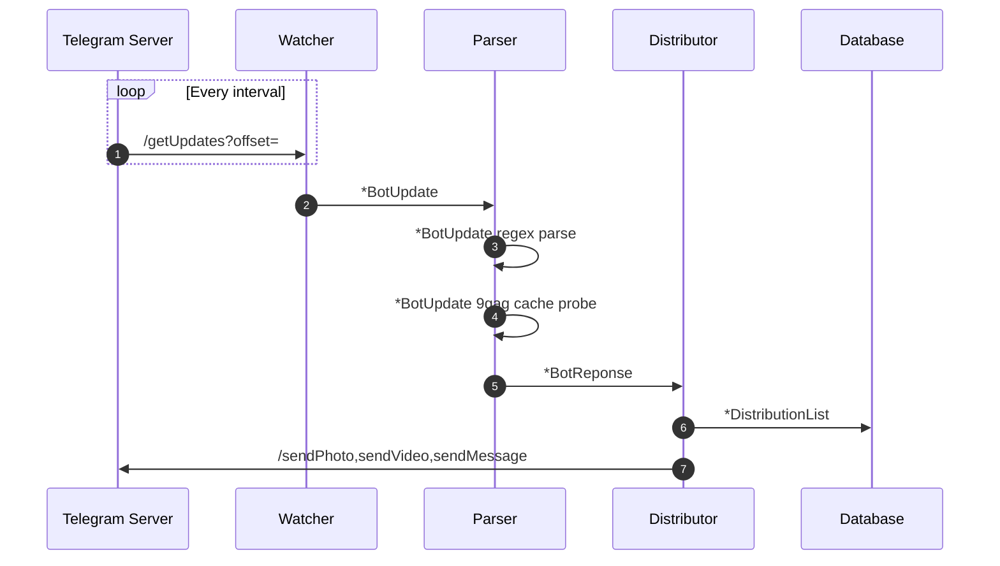

# telegram-scaffold
This library enables you to build telegram apps rapidly , scaffolding around the telegram bots. Just get your bot up and running provide the authentication details and you have polling, functions, response functions available

The question now is Parsing responsibility is the cruicial for object conversion. The conversion of object from what the Watcher sees incoming to what the Distributor dispatches outgoing. This parser has the business logic that will govern how and which messages are dispatched. 
My intention here is to try an get the most elegant and efficient solution out. This may be a simple problem but solving it over and over again can give my coding skills the much needed refinement
